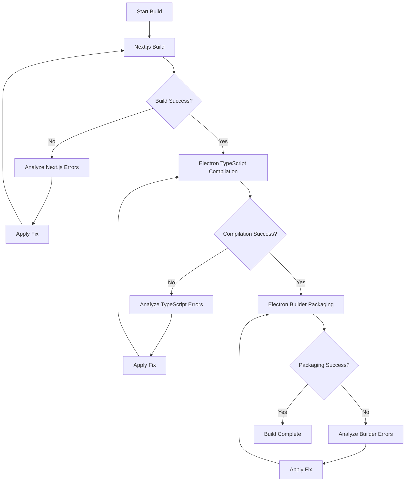
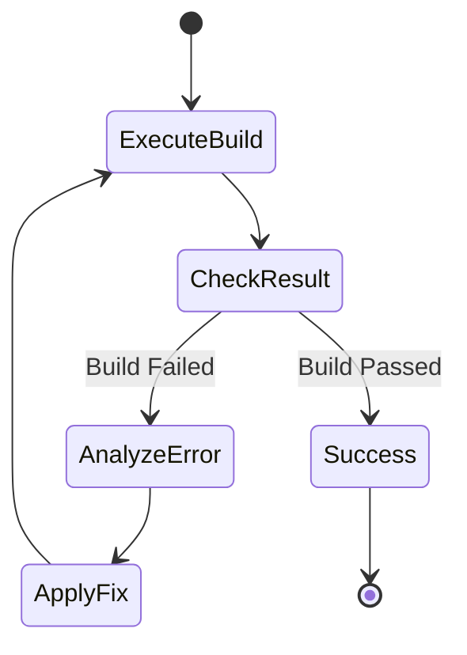

# Build Assistance and Error Resolution Design

## Objective

Execute the full production build process for the Vylos AI Electron application and systematically resolve any compilation, bundling, or packaging errors that emerge during the build lifecycle.

## Build Process Overview

The build process consists of three sequential stages:

1. Next.js Static Export Generation
2. Electron TypeScript Compilation
3. Electron Builder Packaging

### Build Flow

## Build Stages Specification

### Stage 1: Next.js Static Export

**Command**: `npm run build`

**Purpose**: Generate static HTML/CSS/JS files from the Next.js application for Electron to serve.

**Output Location**: `out/` directory

**Configuration**:
- Export mode: Static export (`output: 'export'`)
- Distribution directory: `out`
- Image optimization: Disabled (unoptimized)

**Common Error Categories**:

| Error Type | Likely Cause | Resolution Strategy |
|------------|-------------|---------------------|
| TypeScript compilation errors | Type mismatches, missing types, incorrect imports | Fix type annotations, add missing type definitions |
| Import resolution failures | Missing dependencies, incorrect paths | Install missing packages, correct import paths |
| Build configuration issues | Invalid Next.js config, incompatible options | Adjust next.config.ts settings |
| Runtime code in build | Code that requires browser/node APIs during build | Move to client-side or use dynamic imports |

### Stage 2: Electron TypeScript Compilation

**Command**: `npm run build:electron`

**Purpose**: Compile Electron main process, preload script, and PTY service from TypeScript to JavaScript.

**Input Files**:
- `electron/main.ts`
- `electron/preload.ts`
- `electron/pty-service.ts`

**Output Location**: `electron/dist/` directory

**Configuration**:
- Target: ES2020
- Module system: CommonJS
- Module resolution: Node

**Common Error Categories**:

| Error Type | Likely Cause | Resolution Strategy |
|------------|-------------|---------------------|
| Missing type definitions | Electron/Node types not available | Install @types packages |
| Module resolution errors | Incorrect imports, missing dependencies | Fix import statements, install dependencies |
| API compatibility issues | Using deprecated or unavailable Electron APIs | Update to current Electron API patterns |
| PTY service compilation errors | node-pty type mismatches | Verify node-pty installation and types |

### Stage 3: Electron Builder Packaging

**Command**: `electron-builder` (invoked by `npm run electron:build`)

**Purpose**: Package the compiled application into a platform-specific executable installer.

**Input Requirements**:
- Compiled Next.js static files (`out/`)
- Compiled Electron files (`electron/dist/`)
- Build resources (`build/` directory)
- Application icons (platform-specific)

**Platform Targets**:
- Windows: NSIS installer (.exe)
- macOS: ICNS icon (.dmg)
- Linux: AppImage

**Common Error Categories**:

| Error Type | Likely Cause | Resolution Strategy |
|------------|-------------|---------------------|
| Missing build resources | Icon files not found | Create or provide required icon files |
| File inclusion errors | Required files not in build configuration | Update `files` array in package.json build config |
| Native module issues | node-pty or other native modules not rebuilt | Run electron-rebuild |
| Code signing errors | Missing certificates or invalid config | Configure code signing or disable for development |
| Dependency packaging errors | Missing runtime dependencies | Ensure all dependencies are in dependencies (not devDependencies) |

## Error Resolution Workflow

### Error Detection and Analysis

For each build stage failure:

1. **Capture Error Output**: Record the complete error message, stack trace, and context
2. **Categorize Error**: Identify error type (TypeScript, dependency, configuration, packaging)
3. **Identify Root Cause**: Determine the underlying issue causing the error
4. **Determine Resolution**: Select appropriate fix strategy from the error categories above

### Resolution Application

**Modification Scope**:
- Source code files (TypeScript/TypeScript React files)
- Configuration files (tsconfig.json, next.config.ts, package.json)
- Dependency management (package.json dependencies)
- Build resources (icons, assets)

**Verification**:
After each fix, re-execute the failed build stage to confirm resolution.

### Iterative Error Handling

The process should continue iteratively:

## Specific Error Scenarios and Resolutions

### TypeScript Type Errors

**Detection**: Errors containing "Type 'X' is not assignable to type 'Y'" or "Property 'X' does not exist"

**Resolution Approach**:
- Add missing type definitions
- Correct type annotations
- Add type assertions where appropriate
- Update interface/type definitions
- Install missing @types packages

### Dependency Errors

**Detection**: "Cannot find module" or "Module not found"

**Resolution Approach**:
- Verify package installation: Check package.json and node_modules
- Install missing dependencies: Run npm install for missing packages
- Correct import paths: Fix relative or absolute import statements
- Check dependency versions: Ensure compatibility between packages

### Electron-Specific Errors

**Detection**: Errors related to Electron APIs, IPC, or native modules

**Resolution Approach**:
- Update Electron API usage to current version patterns
- Ensure proper IPC channel definitions match between main and renderer
- Rebuild native modules: Run npm run rebuild for node-pty
- Verify electron-builder configuration

### Build Resource Errors

**Detection**: "Icon file not found" or resource path errors

**Resolution Approach**:
- Create placeholder icons if missing
- Update build configuration paths to match actual resource locations
- Ensure build directory structure matches configuration
- Use cross-platform compatible paths

### Next.js Build Errors

**Detection**: Errors during Next.js compilation or export

**Resolution Approach**:
- Verify all components are properly exported
- Ensure no server-side only code in client components
- Check for dynamic imports that need proper configuration
- Validate next.config.ts settings for static export
- Ensure all environment variables are available

## Build Verification Criteria

### Success Indicators

**Stage 1 Success**:
- `out/` directory created with HTML, CSS, JS files
- No TypeScript compilation errors
- All pages and assets exported successfully

**Stage 2 Success**:
- `electron/dist/` directory contains main.js, preload.js, pty-service.js
- No TypeScript compilation errors
- All Electron modules compiled successfully

**Stage 3 Success**:
- Platform-specific installer/executable created in `dist/` directory
- All files packaged correctly
- Native modules included and functional
- Application launches without errors

### Final Build Artifacts

**Expected Outputs**:
- Windows: `dist/Vylos AI Setup [version].exe` (NSIS installer)
- macOS: `dist/Vylos AI-[version].dmg`
- Linux: `dist/Vylos AI-[version].AppImage`

**Artifact Validation**:
- Installer size is reasonable (not missing dependencies)
- Application can be installed and launched
- All features function as expected in packaged version

## Dependencies and Prerequisites

### Required Dependencies

**Runtime Dependencies** (must be in dependencies, not devDependencies):
- @google/generative-ai
- @monaco-editor/react
- @homebridge/node-pty-prebuilt-multiarch
- next, react, react-dom
- electron-specific utilities (chokidar, fs-extra, isomorphic-git)
- UI libraries (lucide-react, xterm, zustand)

**Build Dependencies** (devDependencies):
- electron
- electron-builder
- electron-rebuild
- typescript
- build tools (concurrently, cross-env, wait-on)

### Environment Requirements

**Node.js**: Version compatible with TypeScript 5 and Next.js 16

**Platform-Specific Build Tools**:
- Windows: Visual Studio Build Tools (for native modules)
- macOS: Xcode Command Line Tools
- Linux: Build essentials (gcc, make)

## Error Logging and Documentation

### Error Documentation Format

For each error encountered and resolved:

**Error Record**:
- Build stage where error occurred
- Complete error message
- Files involved
- Root cause identified
- Resolution applied
- Verification result

**Purpose**: Create a reference for similar future errors and document the build stabilization process.

## Constraints and Limitations

**Modification Boundaries**:
- Only modify files necessary to resolve build errors
- Maintain application functionality and intended behavior
- Preserve existing architectural patterns
- Keep dependency updates minimal and targeted

**Build Environment**:
- Use existing package versions unless incompatibility is the root cause
- Respect the current Electron version (39.2.7)
- Maintain Next.js 16.1.1 compatibility
- Use TypeScript 5 language features

## Success Criteria

**Build Process Complete** when:
1. All three build stages execute without errors
2. Platform-specific installer is generated successfully
3. Generated application launches and functions correctly
4. No compilation, bundling, or packaging errors remain
5. All build artifacts are created in expected locations

**Quality Indicators**:
- Zero TypeScript compilation errors
- All dependencies resolved correctly
- Native modules functioning properly
- Build completes within reasonable time
- Packaged application size is appropriate