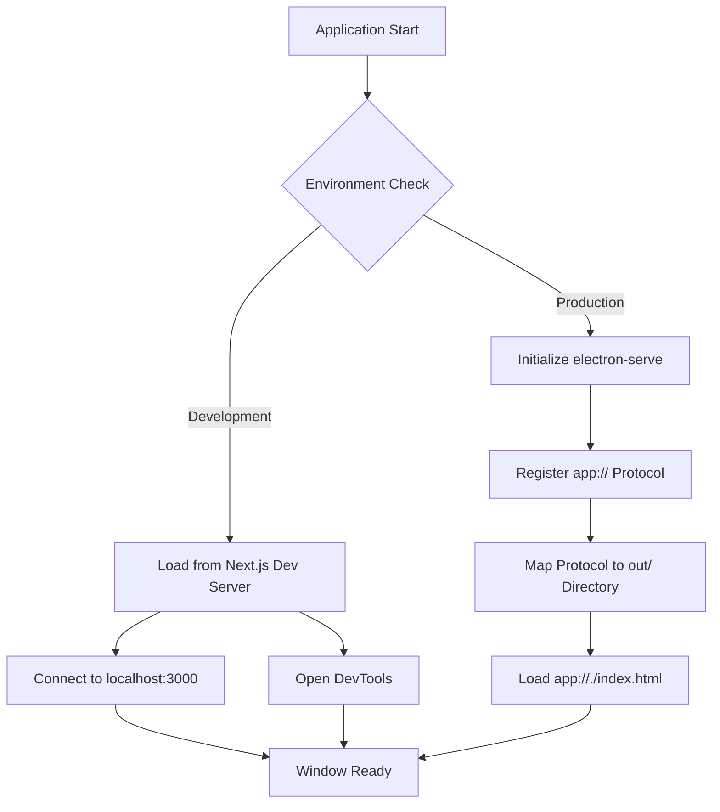
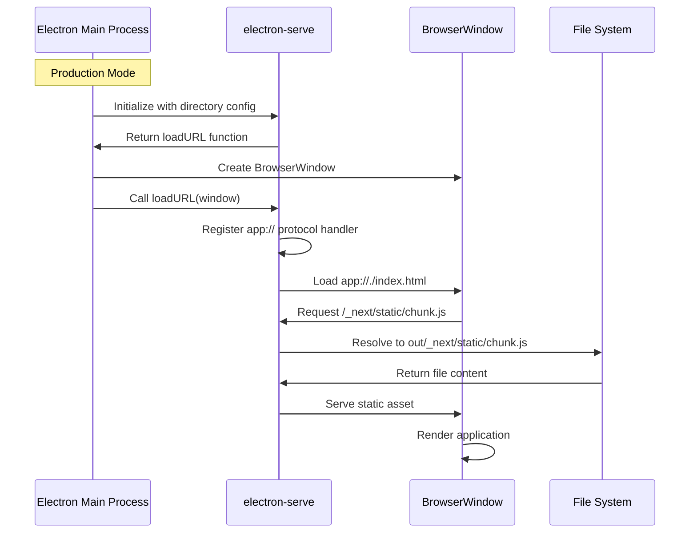

# Next.js Static Asset Loading Fix for Electron Production Build

## Problem Statement

The packaged Electron application displays a black screen with console errors indicating asset loading failures. The root cause is incorrect asset path resolution when serving Next.js static exports through the file protocol in production.

### Current Behavior

When the Electron app is packaged and run in production mode, the following occurs:

- Next.js generates static assets with paths prefixed by `/_next/static/...`
- Electron main process attempts to load these assets using the `file://` protocol
- The browser tries to resolve paths as absolute file system paths (e.g., `file:///C:/_next/static/...`)
- These paths do not exist on the file system, resulting in ERR_FILE_NOT_FOUND errors
- The application window displays a black screen due to failed asset loading

### Root Cause Analysis

The main process contains conflicting loading logic:

1. First, it loads the URL using direct file protocol path construction
2. Then, it attempts to initialize electron-serve and load through custom protocol
3. This creates a race condition where the initial file protocol load wins but cannot resolve assets correctly

The electron-serve package is already installed but not properly integrated into the loading flow.

## Design Objectives

- Eliminate the file protocol asset loading issue in production builds
- Properly implement electron-serve to handle static asset serving
- Maintain development mode functionality with Next.js dev server
- Ensure clean separation between development and production loading strategies
- Support cross-platform packaging without path resolution issues

## Solution Architecture

### Loading Strategy Decision Tree



### Component Interaction Flow



## Implementation Design

### Main Process Refactoring

The window creation and loading logic requires restructuring to eliminate conflicts and properly initialize electron-serve before any loading attempts.

#### Window Creation Flow

**Development Mode:**
- Initialize BrowserWindow with standard configuration
- Load URL pointing to Next.js development server at localhost:3000
- Enable DevTools for debugging

**Production Mode:**
- Import and initialize electron-serve before window creation
- Configure electron-serve to serve from the out directory
- Create BrowserWindow with identical configuration to development
- Use electron-serve's loadURL function to properly initialize the custom protocol
- Load the application through the app:// protocol

#### electron-serve Configuration

| Parameter | Value | Rationale |
|-----------|-------|-----------|
| directory | Path to 'out' folder | Static export output location from Next.js build |
| scheme | app (default) | Custom protocol name for serving assets |
| partition | undefined (default) | Use default session partition |

The directory path must be resolved relative to the compiled main.js location in production, accounting for the electron/dist build output structure.

### Path Resolution Strategy

#### Development Environment

- Assets loaded directly from Next.js dev server
- No path resolution required
- Hot module replacement and live reload supported

#### Production Environment

Path resolution must account for the packaged application structure:

**Compiled Structure:**
```
app.asar (or unpacked)
├── electron/dist/
│   ├── main.js (entry point)
│   └── preload.js
├── out/ (Next.js static export)
│   ├── index.html
│   ├── _next/
│   │   └── static/
│   └── ...
└── node_modules/
```

The out directory sits at the same level as electron/dist in the packaged structure. Path resolution from main.js location requires navigating up to parent directory, then into out directory.

### Loading Sequence Modification

**Current Problematic Sequence:**
1. Create window
2. Load file:// URL immediately
3. Attempt electron-serve initialization (too late)

**Corrected Sequence:**
1. Initialize electron-serve (if production)
2. Create window
3. Use electron-serve's loadURL function to load application
4. Window receives properly configured protocol handler

### Configuration Validation

The electron-builder configuration already includes the out directory in the files array, ensuring static exports are packaged correctly. No modifications required to package.json build configuration.

## Technical Specifications

### Module Requirements

| Module | Purpose | Status |
|--------|---------|--------|
| electron-serve | Custom protocol handler for static file serving | Already installed (v3.0.0) |
| Next.js static export | Generate standalone static files | Already configured |

### Environment Detection

The solution relies on NODE_ENV environment variable to distinguish between development and production modes. This variable is:

- Set to 'development' during electron:dev script execution via cross-env
- Undefined or set to 'production' during packaged application runtime

### Protocol Handler Behavior

The app:// protocol registered by electron-serve:

- Maps requests to file system paths within the configured directory
- Handles relative path resolution automatically
- Supports all standard HTTP-like path patterns
- Returns appropriate MIME types based on file extensions
- Serves index.html for directory requests

### Error Handling

The solution naturally handles common error scenarios:

- Missing files return appropriate error responses through protocol handler
- Invalid paths are resolved relative to the out directory
- electron-serve handles MIME type detection automatically
- No manual error handling required in main process for asset loading

## Implementation Checklist

The following modifications are required to the main process file:

- [ ] Remove the immediate file protocol URL loading after window creation
- [ ] Move electron-serve initialization to occur before window creation in production mode
- [ ] Remove the duplicate electron-serve initialization that occurs after loading
- [ ] Ensure electron-serve's loadURL function is used instead of direct window.loadURL in production
- [ ] Verify path resolution to out directory accounts for compiled main.js location
- [ ] Maintain existing development mode behavior unchanged
- [ ] Preserve all IPC handlers and other functionality

## Testing Strategy

### Functional Verification

**Development Mode Testing:**
- Verify application loads from localhost:3000
- Confirm DevTools open automatically
- Test hot module replacement functionality
- Validate all IPC handlers function correctly

**Production Mode Testing:**
- Build application with electron:build script
- Install packaged application on target platform
- Launch application and verify no console errors
- Confirm all static assets load successfully (check Network tab)
- Test application functionality matches development behavior
- Verify custom app:// protocol is registered correctly

### Asset Loading Verification

Monitor the following in production:

- No ERR_FILE_NOT_FOUND errors in console
- All /_next/static/* resources return 200 status
- Application renders correctly without black screen
- Initial page load completes successfully
- Navigation between routes works (if applicable)

### Cross-Platform Validation

Test packaged builds on:

- Windows (NSIS installer)
- macOS (if building for Mac)
- Linux AppImage (if building for Linux)

Verify path resolution works correctly across different operating system path conventions.

## Risk Assessment

### Technical Risks

| Risk | Probability | Impact | Mitigation |
|------|-------------|--------|------------|
| electron-serve version compatibility | Low | Medium | Package already installed and compatible with Electron 39 |
| Path resolution in packaged app | Low | High | electron-serve handles path resolution automatically |
| Development mode regression | Low | Medium | Keep development branch unchanged, only modify production path |
| IPC handler interference | Very Low | Low | electron-serve only affects asset loading, not IPC |

### Implementation Complexity

- Low complexity change: primarily reorganizing existing code
- electron-serve package already installed, no new dependencies
- No changes required to Next.js configuration
- No changes required to electron-builder configuration

## Success Criteria

The implementation is considered successful when:

- Packaged Electron application starts without console errors
- All static assets load correctly in production build
- Application renders complete UI without black screen
- Development mode continues to function identically to current behavior
- No regressions in existing IPC functionality
- Cross-platform builds function correctly on target platforms

## Rollback Strategy

If issues arise post-implementation:

- The changes are isolated to the main process window creation logic
- Reverting to previous file protocol loading is straightforward
- No database migrations or persistent state changes involved
- Development mode remains unaffected, providing working fallback
